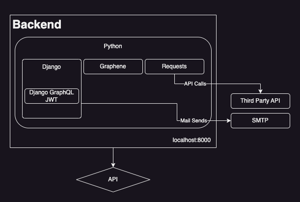
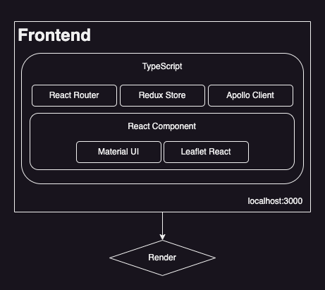
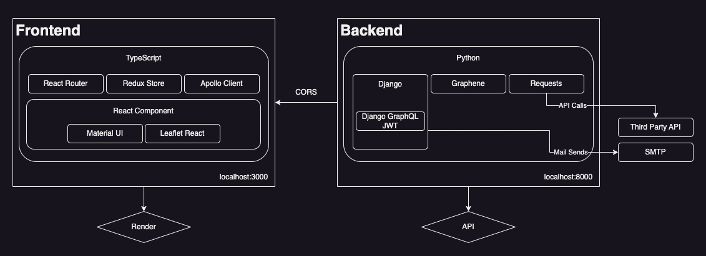

# Project Description

This is a project for retrieving third party public api on https://covid-19.dataflowkit.com/

# Tech Stacks

## Backend

- Python
- Django
- GraphQL

## Frontend

- React
- TypeScript
- Material UI

# Architecture

# How to run

- Clone this repository.
- At the top of the repository(where docker-compose.yml is), run `docker compose up`
- This takes a while to start the application since it runs `npm install` on the first run.
- When it's over, go to `localhost:3000`.