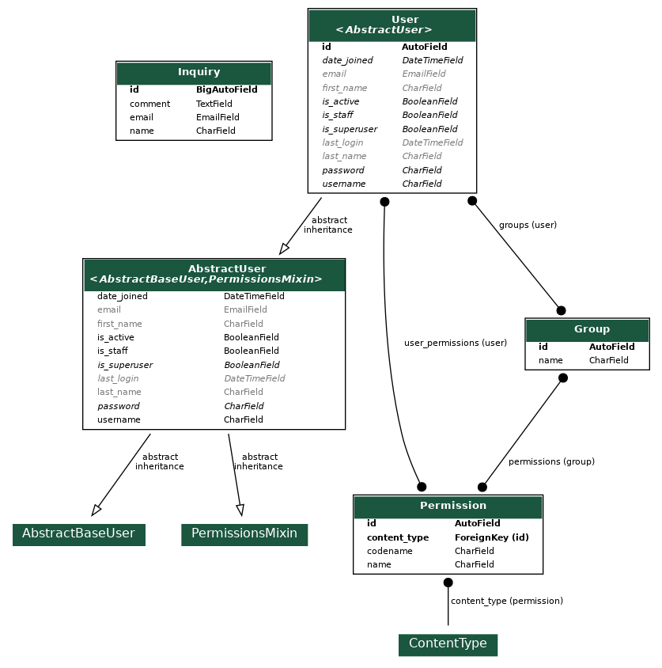

**Table of Contents**
- [Todo](#todo)
- [Building Development Environment](#building-development-environment)
- [Project Details](#project-details)
  - [ERD](#erd)
  - [Specifications](#specifications)
  - [Adding Dependencies](#adding-dependencies)
  - [Policy](#policy)
    - [Django-related Packages and Modules](#django-related-packages-and-modules)
    - [GraphQL-relted Packages and Modules](#graphql-relted-packages-and-modules)
      - [Resolver -- Query Isolation](#resolver----query-isolation)
      - [Mutation implementation -- Mutations mount Isolation](#mutation-implementation----mutations-mount-isolation)
      - [Module Name](#module-name)
  - [Linting, Formatting](#linting-formatting)
- [Tips](#tips)
  - [Generating lockfile](#generating-lockfile)
  - [Generating GraphQL Schema](#generating-graphql-schema)
  - [Generting ERD Diagram](#generting-erd-diagram)
  - [Relative import to prevent circular import](#relative-import-to-prevent-circular-import)


# Todo
- __init__.py での相対インポート
- CountriesQueryのバッチ化

# Building Development Environment

- Install **Docker** if you don't have it

    Available here: https://www.docker.com/
- Build Docker Image
    ```
    # at project root(where docker-compose.yml is)
    docker compose build
    ```
- Create and Rund the Container
    ```
    docker compose up -d
    ```
- (Optional) Load data
    ```
    # at /backend inside the container
    python manage.py loaddata inquiry users
    ```
- Enjoy Development!

# Project Details

Backend works as a GraphQL Server. It is mainly used to retrieve/submit inquiry forms, retrieve/create users in Django.

## ERD


## Specifications

- **Python**: 3.11.4
- **Django**: 4.2.2
- **SQLite**
- Pip packages and their versions are described in `requirements.txt` and `requirements.lock`.

## Adding Dependencies

- Add name of the package in `requirements.txt` as a record.
- Execute `pip install [the package you want to add]` inside the container.
  ```
  # at /backend inside the container
  pip install [the package]
  ```
- Eject Dependencies
  ```
  pip list --format freeze --not-required > requirements.lock
  ```

## Policy
### Django-related Packages and Modules
**Models**, **Forms**, **Tests** are in `models`, `forms`, `tests` packages respectively instead of models.py, forms.py, tests.py.

In order to import those classes like `from project.app.models import Model`(not like `from project.models.module import Model`), import classes properly in `__init__.py` in each packages. Refer to the exisiting `__init__.py`s for details.

### GraphQL-relted Packages and Modules
GraphQL-related files are in `graphql` packages, consisting of `type`, `query`, `resolver` and `mutation` packagess.

#### Resolver -- Query Isolation

Resolver(that is to say, Query implementation) code is separated from Query definition code since it is prone to be long. By delegating each specific Resolving logic to other classes, Query definition class is kept clean.

#### Mutation implementation -- Mutations mount Isolation

Mutation implementation code is separated from Mutations mount code since it is prone to be long. By delegating each specific Mutating logic to other classes, Mutations mount class is kept clean.

#### Module Name

- **`type` package**: Type definition file ends with **type**.
- **`query` package**: Query definition file ends with **query**.
- **`resolver` package**: Resolver definition file ends with **resolver**.
- **`mutation` package**:
    - Mutations mount[^1] file ends with **mutations**.
    - Mutation implementation[^2] file starts with either of the following and ends with **mutation**:
      - create
      - update
      - delete

[^1]: The Class that relates Mutation(s) with GraphQL ObjectType.
[^2]: The Class that defines specific Mutation implementation.


## Linting, Formatting

Linting and formatting are **automatically excecuted** when you **run the backend container**. You can execute these tools on your own as well.

- **flake8** for Linting
  ```
  # at /backend inside the container
  flake8 .
  ```
- **black**, **isort** for Formatting
  ```
  # at /backend inside the container
  black .
  isort .
  ```

# Tips

## Generating lockfile
```
# at /backend inside the container
pip list --format freeze --not-required > requirements.lock
```

## Generating GraphQL Schema
(to `./covidsite/static` so that [graphql-code-generate](https://the-guild.dev/graphql/codegen/docs/getting-started) can refer to it from the frontend container)
```
# at /backend inside the container
python manage.py graphql_schema --out=covidsite/static/schema.json
```

## Generting ERD Diagram
```
# at /backend inside the container
python manage.py graph_models -o erd.png
```

## Relative import to prevent circular import

Import relatively when importing other modules in the same package.
