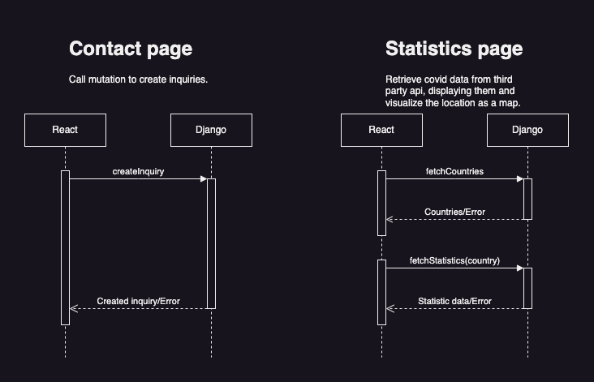

- [Building Development Environment](#building-development-environment)
- [Project Details](#project-details)
  - [Sequence Diagram](#sequence-diagram)
  - [Specifications](#specifications)
  - [Adding Dependencies](#adding-dependencies)
  - [Policy](#policy)
  - [Linting, Formatting](#linting-formatting)
- [Tips](#tips)
  - [Generating GraphQL Types](#generating-graphql-types)
- [Getting Started with Create React App](#getting-started-with-create-react-app)
  - [Available Scripts](#available-scripts)
    - [`npm start`](#npm-start)
    - [`npm test`](#npm-test)
    - [`npm run build`](#npm-run-build)
    - [`npm run eject`](#npm-run-eject)
  - [Learn More](#learn-more)

# Building Development Environment

- Install **Docker** if you don't have it

  Available here: https://www.docker.com/

- Build Docker Image
  ```
  # at project root(where docker-compose.yml is)
  docker compose build
  ```
- Create and Rund the Container
  ```
  docker compose up -d
  ```
- (Optional)Install Packages
  ```
  # at /frontend inside the container
  npm install
  ```
  You will get `node_modules` directory at `/frontend`.
  This is not normally needed since when you `docker compose up -d` without the directory of `node_modules`, `npm install` is automatically executed inside the container.
  If there is a problem installing packages in the container, you may execute this command after solving the problem.
- Enjoy Development!

# Project Details

Frontend works as UI of the application. It is mainly used to retrieve/submit inquiry forms, retrieve/create users in Django.

## Sequence Diagram



## Specifications

- **Node**: 18.16.1
- **Npm**: 9.7.2
- **React**: 18.2.0
- **TypeScript**: 4.9.5
- Other npm packages and their versions are described in `package.json` and `package-lock.json`.

## Adding Dependencies

- Execute `npm install [package you want to add]` inside the container.
  ```
  # at /frontend inside the container
  npm install [option] [something]
  ```

## Policy

GraphQL-Related files are in `src/graphql`.

- `graphql.tsx` is generated by `graphql-codegen`. You must not edit any of this file.
- `use*.tsx` are hooks for requesting GraphQL Server.

  Write query/mutation using `gql` function and then generate types with `npm run compile` that you get the proper types for defining hooks.

## Linting, Formatting

Linting and formatting are **automatically excecuted** when you **run the backend container**. You can execute these tools on your own as well.

- **eslint** for Linting

  ```
  # at /frontend inside the container
  npm run lint
  ```

- **prettier** for Formatting
  ```
  # at /frontend inside the container
  npm run format
  ```

# Tips

## Generating GraphQL Types

```
# at /frontend inside the container
npm run compile
```

# Getting Started with Create React App

This project was bootstrapped with [Create React App](https://github.com/facebook/create-react-app).

## Available Scripts

In the project directory, you can run:

### `npm start`

Runs the app in the development mode.\
Open [http://localhost:3000](http://localhost:3000) to view it in the browser.

The page will reload if you make edits.\
You will also see any lint errors in the console.

### `npm test`

Launches the test runner in the interactive watch mode.\
See the section about [running tests](https://facebook.github.io/create-react-app/docs/running-tests) for more information.

### `npm run build`

Builds the app for production to the `build` folder.\
It correctly bundles React in production mode and optimizes the build for the best performance.

The build is minified and the filenames include the hashes.\
Your app is ready to be deployed!

See the section about [deployment](https://facebook.github.io/create-react-app/docs/deployment) for more information.

### `npm run eject`

**Note: this is a one-way operation. Once you `eject`, you can’t go back!**

If you aren’t satisfied with the build tool and configuration choices, you can `eject` at any time. This command will remove the single build dependency from your project.

Instead, it will copy all the configuration files and the transitive dependencies (webpack, Babel, ESLint, etc) right into your project so you have full control over them. All of the commands except `eject` will still work, but they will point to the copied scripts so you can tweak them. At this point you’re on your own.

You don’t have to ever use `eject`. The curated feature set is suitable for small and middle deployments, and you shouldn’t feel obligated to use this feature. However we understand that this tool wouldn’t be useful if you couldn’t customize it when you are ready for it.

## Learn More

You can learn more in the [Create React App documentation](https://facebook.github.io/create-react-app/docs/getting-started).

To learn React, check out the [React documentation](https://reactjs.org/).
